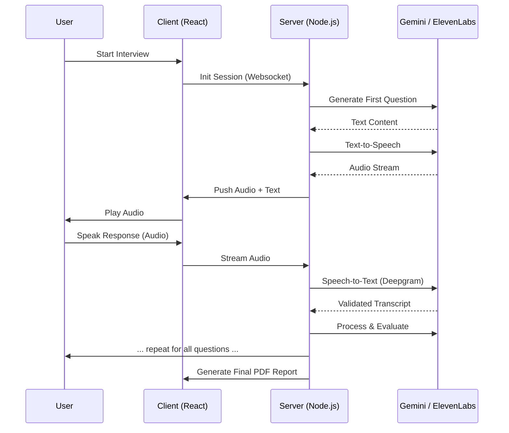
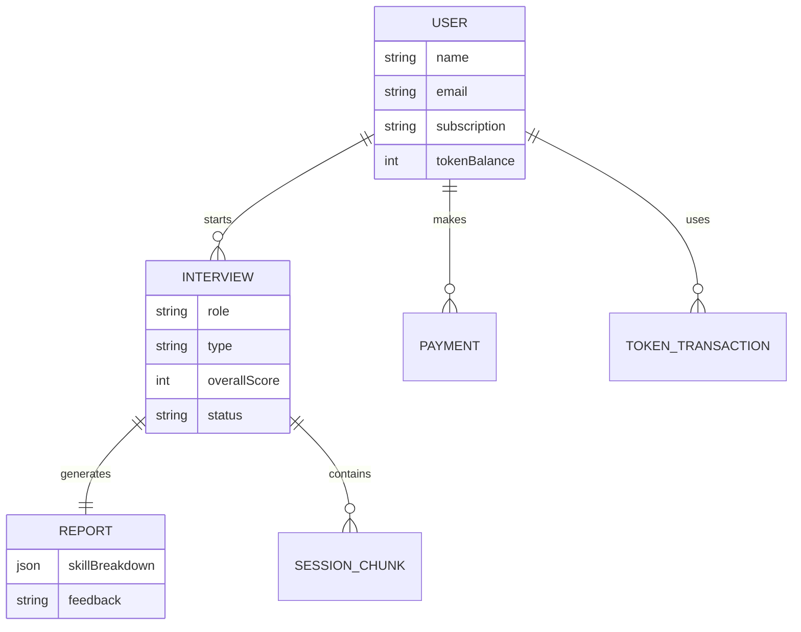

# Interviewmate

Voice-first AI mock interviews that feel real, with actionable feedback to improve technical + communication performance.

## Problem
- **Low realism → high anxiety**: candidates underperform in real interviews.
- **Coaching is expensive**: most people can’t access quality prep.
- **Generic feedback**: doesn’t reveal exact weak points.
- **Peer mocks are inconsistent**: low rigor, low objectivity.

## Solution (Interviewmate)
- **Human-like interviews** using Generative AI + real-time voice.
- **Deep follow-ups** powered by **Google Gemini**.
- **Ultra-low latency voice** via **Deepgram (STT)** + **ElevenLabs (TTS)**.
- **Performance analytics**: confidence, clarity, structure, technical depth.
- **Multiple tracks**: HR, Technical, Managerial — role/company aligned.

## Target Users
- **Job seekers** targeting top tech roles.
- **Career switchers** validating skills in realistic scenarios.
- **Students** preparing for placements.
- **Hiring teams** using it for candidate readiness practice.

## Guarantees
- **Privacy-first**: sessions are encrypted and secure.
- **Zero-lag experience**: websocket-based real-time architecture.
- **Industry-aligned questions**: generated per role and current trends.

## Architecture

### High-Level System Design


### End-to-End Process Flow


<<<<<<< HEAD
### ER Diagram


## Tech Stack
| Layer | Technologies |
| :--- | :--- |
| **Frontend** | React, Tailwind CSS, Framer Motion, Socket.io-client, Radix UI, Recharts |
| **Backend** | Node.js, Express.js, Socket.io, Mongoose |
| **AI (LLM)** | Google Gemini Pro |
| **Voice (STT/TTS)** | Deepgram, ElevenLabs |
| **Database** | MongoDB Atlas |
| **Cloud/Infrastructure** | Razorpay, Google OAuth 2.0, jsPDF |

## Project Structure
```text
interviewmate/
├── client/                 # Frontend - React (Vite)
│   ├── src/
│   │   ├── components/     # UI Components (Radix, Framer)
│   │   ├── pages/          # Interview, Dashboard, Landing
│   │   ├── services/       # API & Socket handlers
│   │   └── context/        # Auth & State management
├── server/                 # Backend - Node.js
│   ├── models/             # Mongoose Schemas (User, Interview, etc.)
│   ├── routes/             # REST Endpoints
│   ├── services/           # AI, STT, TTS logic
│   ├── websocket/          # Real-time interview handlers
│   └── middleware/         # Auth & Validation
├── .env                    # Environment variables
└── package.json            # Dependencies & Scripts
```


## 📄 License
This project is licensed under the MIT License - see the [LICENSE](LICENSE) file for details.

---
*Built with ❤️ for candidates everywhere.*

