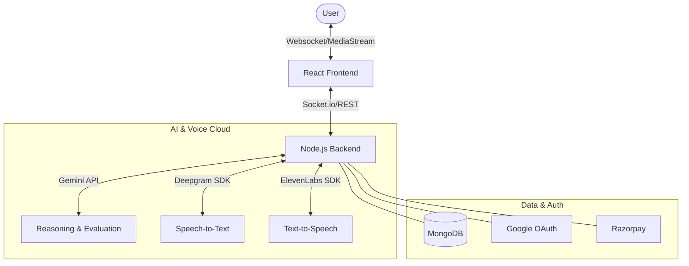
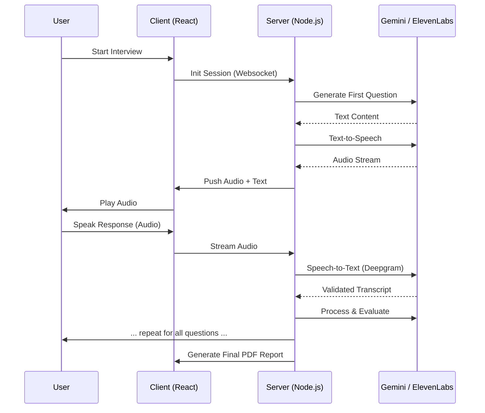
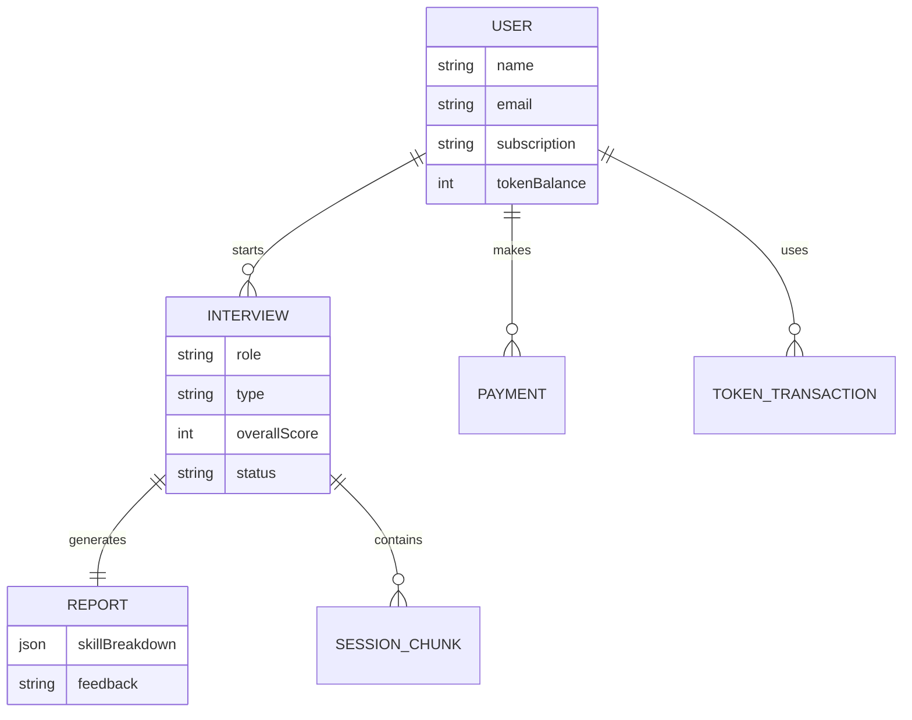

# InterviewMate 🎙️🤖

**Master your job interviews with a real-time, AI-powered mock interview partner that speaks, listens, and evaluates.**

[](https://opensource.org/licenses/MIT)
[](https://reactjs.org/)
[](https://nodejs.org/)
[](https://www.mongodb.com/)

---

## 🚀 One-Line Value Proposition
An immersive, voice-first AI platform that simulates realistic interview scenarios, providing actionable feedback to bridge the gap between preparation and performance.

## 🔴 Problem
- **Interview Anxiety**: Lack of realistic practice leads to performance dips during high-stakes interviews.
- **Inaccessible Coaching**: Professional interview coaching is often prohibitively expensive.
- **Vague Feedback**: Generic advice doesn't help candidates identify specific technical or communication gaps.
- **Inconsistent Peer Practice**: Mock interviews with friends often lack the rigor and objectivity of real industry standards.

## ✨ Solution
InterviewMate leverages cutting-edge Generative AI and real-time audio processing to provide a seamless "Human-like" interview experience.
- **Emotional & Technical Intelligence**: Powered by Google Gemini to understand complex responses and follow up deeply.
- **Voice-to-Voice Interaction**: Ultra-low latency speech-to-text (Deepgram) and text-to-speech (ElevenLabs).
- **Comprehensive Analytics**: Data-driven breakdown of communication, confidence, and technical knowledge.
- **Modular Interview Tracks**: Choose between HR, Technical, or Managerial mocks tailored to your target company.

## 👥 Who Is This For
- **Job Seekers**: Prepare for top-tier tech companies with realistic simulations.
- **Career Switchers**: Test your new skills in a safe, simulated environment.
- **Students**: Ace campus placements with targeted HR and Technical practice.
- **Hiring Managers**: Use as a tool to help candidates practice before the real session.

## ✅ Guarantees
- **Privacy First**: All sessions are private; your data is encrypted and secure.
- **Real-Time Synergy**: Zero-lag websocket architecture for fluid conversations.
- **Industry Alignment**: Questions are dynamically generated based on current industry trends and specific job roles.

## 🚫 Non-Goals
- We do **not** provide actual job placements or guarantees.
- We do **not** replace the value of human connection but rather prepare you for it.
- This is **not** a tool for cheating; it is designed for honest preparation and self-improvement.

## 🏗️ Architecture

### High-Level System Design


### End-to-End Process Flow


### ER Diagram


## 🛠️ Tech Stack
| Layer | Technologies |
| :--- | :--- |
| **Frontend** | React, Tailwind CSS, Framer Motion, Socket.io-client, Radix UI, Recharts |
| **Backend** | Node.js, Express.js, Socket.io, Mongoose |
| **AI (LLM)** | Google Gemini Pro |
| **Voice (STT/TTS)** | Deepgram, ElevenLabs |
| **Database** | MongoDB Atlas |
| **Cloud/Infrastructure** | Razorpay, Google OAuth 2.0, jsPDF |

## 📂 Project Structure
```text
interviewmate/
├── client/                 # Frontend - React (Vite)
│   ├── src/
│   │   ├── components/     # UI Components (Radix, Framer)
│   │   ├── pages/          # Interview, Dashboard, Landing
│   │   ├── services/       # API & Socket handlers
│   │   └── context/        # Auth & State management
├── server/                 # Backend - Node.js
│   ├── models/             # Mongoose Schemas (User, Interview, etc.)
│   ├── routes/             # REST Endpoints
│   ├── services/           # AI, STT, TTS logic
│   ├── websocket/          # Real-time interview handlers
│   └── middleware/         # Auth & Validation
├── .env                    # Environment variables
└── package.json            # Dependencies & Scripts
```

## 💻 Running Locally

### Prerequisites
- Node.js (v18+)
- MongoDB Atlas or local instance
- API Keys: Google Gemini, Deepgram, ElevenLabs

### Steps
1. **Clone the project**
   ```bash
   git clone https://github.com/yourusername/interviewmate.git
   cd interviewmate
   ```

2. **Setup Server**
   ```bash
   cd server
   npm install
   # Create .env with MONGODB_URI, GEMINI_API_KEY, etc.
   npm run dev
   ```

3. **Setup Client**
   ```bash
   cd ../client
   npm install
   # Create .env with VITE_SERVER_URL
   npm run dev
   ```

## 📄 License
This project is licensed under the MIT License - see the [LICENSE](LICENSE) file for details.

---
*Built with ❤️ for candidates everywhere.*

